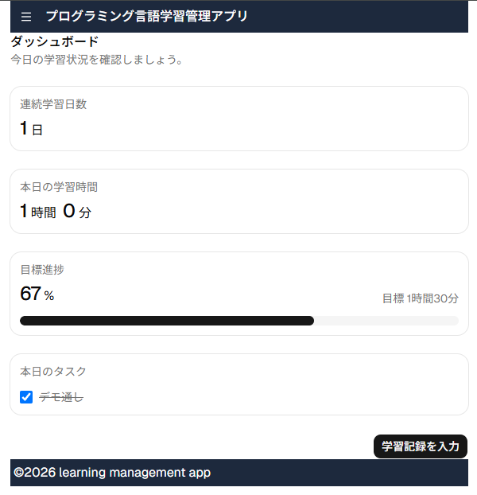
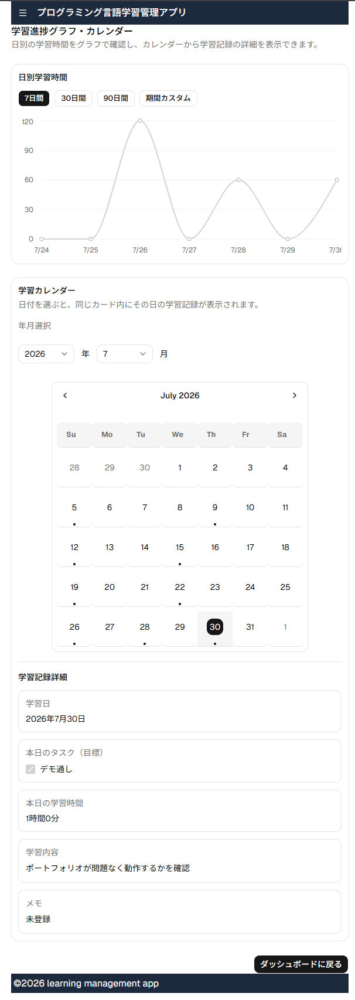
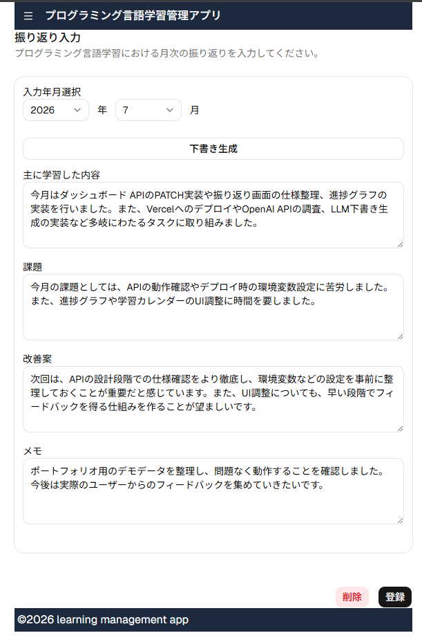
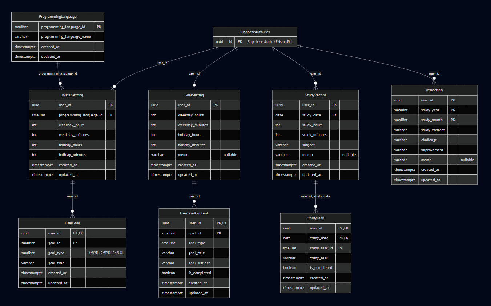

# 学習管理アプリ

プログラミング言語学習の記録・目標管理・振り返りを行う Web アプリケーションです。  
学習記録の入力、ダッシュボードでの当日の学習進捗確認、月次振り返り、学習時間のグラフ・カレンダー表示に対応しています。  
振り返り入力では OpenAI API を用いた下書き生成機能を提供します。

## 制作背景

プログラミング学習を続ける中で、成長実感が持てずモチベーション維持が難しいと感じていました。  
成果がすぐに出なくても、学習量や継続状況を可視化できれば自己肯定感につながるのではないか、という思いから本アプリを制作しました。

日常生活の中で学習習慣を定着させ、今後も使い続けられるツールにしたいという自分自身のニーズもあります。  
同様にプログラミング言語の学習に取り組む方の継続を支援できるアプリを目指しています。

## ターゲット

- プログラミング言語学習の記録を継続的に行うことが難しい人
- 簡易的に学習状況を把握、管理したい人

## 課題

- 学習記録の入力が手間で、継続的に登録ができない。数日だけの活用に留まる
- どれくらい学習したかが分からず、成長を感じにくい
- 記録をしても見返さずに上手く活用できないため、改善に繋がらない

## 解決

- 入力項目のシンプル化。連続学習日数の表示
- 学習時間のグラフ化、カレンダーで学習記録を表示させ、学習状況を可視化
- 月次での振り返りに下書き生成AIを実装し、振り返りやすくする

## デモ環境

| 項目 | 内容 |
|------|------|
| **デモ URL** | https://learning-management-app-eight.vercel.app/ |
| **メールアドレス** | `demo@example.com` |
| **パスワード** | `demo1234!` |

### デモアカウントについて

- 初期設定・目標設定・学習記録・振り返りなどの確認用データが登録済みです。
- ログイン後はダッシュボード（`/`）へ遷移します（初期設定済みのため）。
- **初期設定画面**は `/initial-settings` から直接確認できます。
- **振り返り下書き生成（LLM）** は `/reflection-input` で「下書きを生成」ボタンから利用できます。

## スクリーンショット

### ダッシュボード


### 学習進捗（グラフ・カレンダー）


### 振り返り下書き生成


## 主な機能

| 画面 | パス | 概要 |
|------|------|------|
| ログイン | `/login` | Supabase Auth によるログイン |
| サインアップ | `/signup` | 新規アカウント登録 |
| 初期設定 | `/initial-settings` | 学習言語・目標・目標学習時間の登録 |
| ダッシュボード | `/` | 連続学習日数・本日の学習時間・目標達成率・本日のタスク |
| 学習記録入力 | `/study-record-input` | 日別の学習記録・タスクの登録・更新・削除 |
| 目標入力 | `/goal-settings` | 短期・中期・長期目標・目標学習時間の設定 |
| 振り返り | `/reflection` | 月次振り返りの閲覧 |
| 振り返り入力 | `/reflection-input` | 月次振り返りの入力・**LLM 下書き生成** |
| 学習進捗 | `/progress` | 学習時間グラフ・カレンダー・日別詳細 |

## 技術スタック

- **フロントエンド**: Next.js（App Router）, React, TypeScript, Tailwind CSS
- **UI**: shadcn/ui, Radix UI, Lucide React
- **認証**: Supabase Auth
- **データベース**: PostgreSQL（Supabase）, Prisma
- **LLM**: OpenAI API（振り返り下書き生成）
- **グラフ**: Recharts
- **ホスティング**: Vercel

## データベース設計

PostgreSQL（Supabase）上のテーブル構成です。ユーザー認証は Supabase Auth が担い、各テーブルの `user_id` で紐づけています。



## 前提条件
- Node.js 20 以上
- npm


## ローカルでの起動手順

### 1. リポジトリのクローン

```bash
git clone https://github.com/nakanishi-173/learning-management-app.git
cd learning-management-app
```

### 2. 依存関係のインストール

```bash
npm install
```

### 3. 環境変数の設定

`.env.example` をコピーして `.env.local` を作成し、値を設定します。

```bash
cp .env.example .env.local
```

| 変数名 | 説明 | 取得元 |
|--------|------|--------|
| `NEXT_PUBLIC_SUPABASE_URL` | Supabase プロジェクト URL | Supabase → Settings → API |
| `NEXT_PUBLIC_SUPABASE_ANON_KEY` | Supabase anon（公開）キー | 同上 |
| `DATABASE_URL` | PostgreSQL 接続文字列 | Supabase → Settings → Database |
| `OPENAI_API_KEY` | OpenAI API キー | OpenAI Platform（振り返り下書き生成用） |

> `OPENAI_API_KEY` は振り返り下書き生成機能のみ必要です。未設定でも他機能は利用できます。
> `.env.local` は Git に含めません。API キーは README や GitHub に載せないでください。

### 4. データベースの準備

Prisma Client を生成し、スキーマを DB に反映します。

```bash
npx prisma generate
npx prisma db push
```

> レビュー用の確認データはデモ環境（上記 URL）に登録済みです。  

### 5. 開発サーバーの起動

```bash
npm run dev
```

ブラウザで [http://localhost:3000](http://localhost:3000) を開きます。

## 改善ロードマップ

コードレビューおよびポートフォリオ改善のため、GitHub Issues でタスクを管理しています。  
実装が完了した項目には完了日を記載します（未完了は日付なし）。

### フェーズ① レビュー指摘・軽微な修正

コードレビューで指摘された命名・UI・導線の不整合を、小さな単位で修正するフェーズです。

- [x] ページ export 名を XxxPage に統一（2026-08-07） — [#5](https://github.com/nakanishi-173/learning-management-app/issues/5)
- [x] Footer コピーライト表記の修正（2026-08-13） — [#6](https://github.com/nakanishi-173/learning-management-app/issues/6)
- [x] ログイン画面でヘッダーメニューを非表示（2026-08-15） — [#7](https://github.com/nakanishi-173/learning-management-app/issues/7)
- [ ] ヘッダーメニューに「振り返り入力」を追加 — [#8](https://github.com/nakanishi-173/learning-management-app/issues/8)
- [ ] 学習記録入力画面のタスクに削除ボタンを追加 — [#9](https://github.com/nakanishi-173/learning-management-app/issues/9)

### フェーズ② UX・導線の改善

モバイル向け UI に合わせ、ナビゲーション・遷移・ダッシュボード表示を整えるフェーズです。

- [ ] ログイン中のアカウント情報とログアウトを Header に表示 — [#11](https://github.com/nakanishi-173/learning-management-app/issues/11)
- [ ] ダッシュボードに目標一覧を追加 — [#12](https://github.com/nakanishi-173/learning-management-app/issues/12)
- [ ] 登録・ログイン後の自動遷移を整理 — [#13](https://github.com/nakanishi-173/learning-management-app/issues/13)
- [ ] 各登録画面の登録成功後に自動遷移 — [#14](https://github.com/nakanishi-173/learning-management-app/issues/14)
- [ ] ナビゲーションを下部タブ（1行）に変更 — [#15](https://github.com/nakanishi-173/learning-management-app/issues/15)

### フェーズ③ 機能追加

PWA・認証・ダッシュボード強化・Push リマインドなど、継続利用を支援する機能を追加するフェーズです。

- [ ] PWA 対応（ホーム画面への追加） — [#16](https://github.com/nakanishi-173/learning-management-app/issues/16)
- [ ] パスワードリセット — [#17](https://github.com/nakanishi-173/learning-management-app/issues/17)
- [ ] ダッシュボードに前日比学習時間 — [#18](https://github.com/nakanishi-173/learning-management-app/issues/18)
- [ ] 学習記録未入力時の Push リマインド — [#19](https://github.com/nakanishi-173/learning-management-app/issues/19)
- [ ] リマインド通知時刻のユーザー設定 — [#20](https://github.com/nakanishi-173/learning-management-app/issues/20)

> 実装順の目安: フェーズ① → ②（#13 → #14、#15 → #11）→ ③（#16 → #19 → #20）。詳細は [Issues](https://github.com/nakanishi-173/learning-management-app/issues) を参照。

